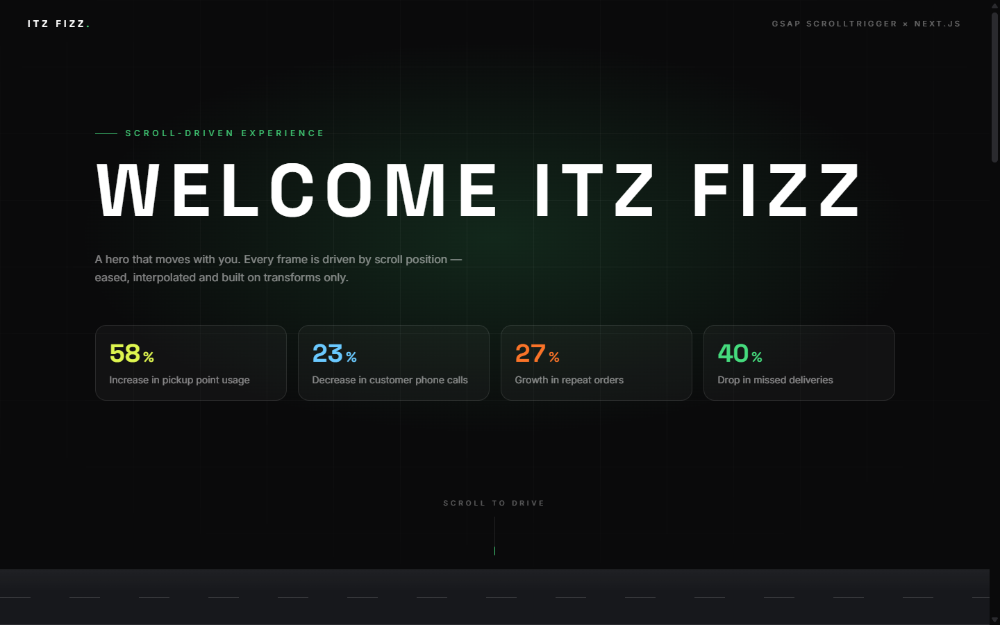
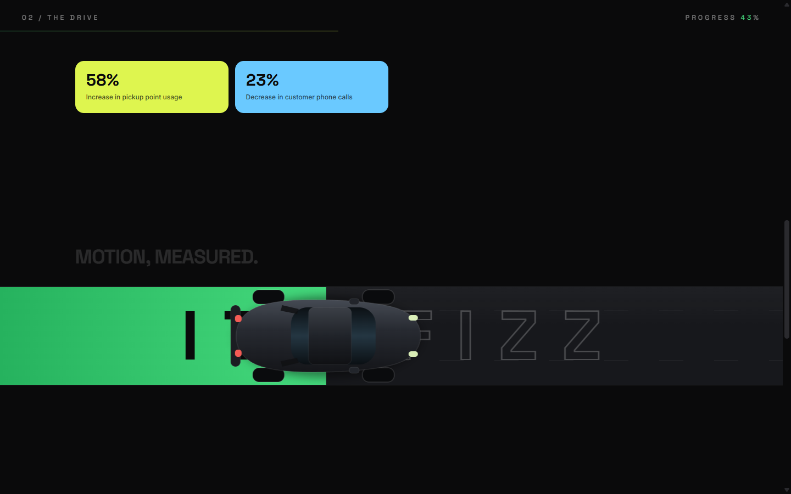
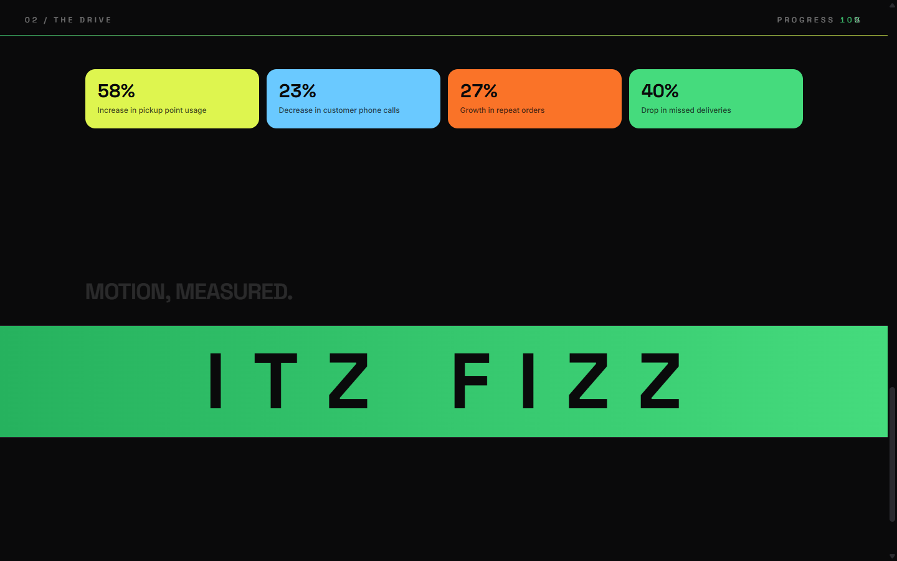

# Scroll-Driven Hero — ITZ FIZZ

A scroll-driven hero section animation inspired by the
[car-scroll-animation reference](https://parasachaturvedi.github.io/car-scroll-animation),
built with **Next.js**, **React**, **Tailwind CSS** and **GSAP ScrollTrigger**.

- **Live demo:** https://thor149.github.io/scroll-driven-hero/
- **Repository:** https://github.com/thor149/scroll-driven-hero

## Preview

| Hero (on load) | Mid-drive (scroll) | Finale |
| --- | --- | --- |
|  |  |  |

## What it does

**1. Hero section (first screen, above the fold)**

- Letter-spaced headline — `W E L C O M E   I T Z   F I Z Z` — split into individual
  letter elements.
- Four impact metrics with percentages and short descriptions.

**2. Initial load animation**

- The eyebrow, headline letters and copy fade/slide in with a staggered timeline
  (`power4.out`, letters rise out of a clipped mask).
- Each statistic card animates in one-by-one with a subtle delay, and the numbers
  count up to their final value.

**3. Scroll-based animation (core feature)**

- The page pins (CSS `position: sticky`) into a drive scene and the car moves
  left → right **purely as a function of scroll progress** — no autoplay, no timers.
- A green trail grows behind the car, its leading edge locked to the car's position.
- The wordmark `ITZ FIZZ` is painted letter-by-letter: each letter flips from a ghost
  outline to solid ink the moment the car fully covers it (the reference's signature move).
- Milestone stat cards pop in at scroll thresholds, a live progress rail and percentage
  readout track the scene, and the car exits the frame as the trail completes.

**4. Motion & performance**

- Only `transform` and `opacity` are animated (`translate`, `scale`); the trail is a
  `scaleX` on a full-width bar, so no layout is triggered while scrolling.
- Scroll smoothing is delegated to GSAP's `scrub`, which interpolates the car between
  scroll positions instead of snapping to each event.
- Letter/wordmark positions are measured once (on mount, on resize, and once web fonts
  are ready) and compared against precomputed pixel values inside the scroll callback —
  no `getBoundingClientRect()` calls per frame.
- `prefers-reduced-motion` is fully respected: animations are skipped and a static,
  fully readable frame is shown instead.

## Tech stack

| Layer | Choice |
| --- | --- |
| Framework | Next.js 15 (App Router, static export) |
| UI | React 19 |
| Styling | Tailwind CSS v4 |
| Animation | GSAP 3 + ScrollTrigger (`@gsap/react`) |
| Hosting | GitHub Pages (GitHub Actions) |

Bootstrap and WordPress were listed as optional extras; they were skipped in favour of a
single, framework-native implementation.

## Getting started

```bash
npm install
npm run dev       # http://localhost:3000
```

Production build (static export to `out/`):

```bash
npm run build
npm run preview   # serves the exported site
```

## Project structure

```
src/
├─ app/
│  ├─ layout.tsx        # fonts (Inter + Space Grotesk), metadata
│  ├─ page.tsx          # hero + drive scene + footer
│  ├─ globals.css       # Tailwind theme, pre-animation states, reduced motion
│  └─ icon.svg          # favicon
├─ components/
│  ├─ Hero.tsx          # first screen: headline + stats intro timeline
│  ├─ DriveScene.tsx    # pinned, scroll-driven scene (car, trail, wordmark, cards)
│  ├─ CarTopView.tsx    # inline SVG car (no image assets)
│  └─ Footer.tsx
├─ data/
│  ├─ stats.ts          # the four impact metrics
│  └─ site.ts           # repository / live URLs
└─ lib/
   └─ gsap.ts           # single GSAP + ScrollTrigger registration point
```

## Deployment

Pushing to `main` triggers `.github/workflows/deploy.yml`, which builds the static
export (`output: "export"`) with `NEXT_PUBLIC_BASE_PATH` set to the repository name and
publishes the `out/` directory to GitHub Pages.

To deploy a fork, enable **Settings → Pages → Source: GitHub Actions** — no other change
is required.
